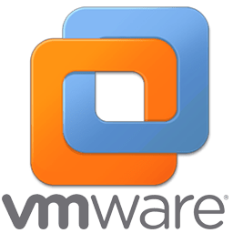

# Neural Computing Stick by Intel Movidius

[Reference Guid](https://geeknavi.net/ai-ml/movidius02)

## Installing on Ubuntu 16.04 VirtualBox on Centos7 PC  

- Installing and run examples on Movidius Neural Computing Stick
- Using CentOS7 as HostOS on Intel-PC  
- Using Ubuntu-16.04 as GuestOS on VirtualBox 
- Using NCSDK(Neural Computing Stick Develompent Kit) 1.12 on GuestOS Ubuntu-16.04

If you needed onto HostOS,  

```
$ yum install -y epel-release  
$ gpasswd -a ogura vboxusers  
```

ホストOSでvboxusersグループに入っていないと、立ち上げたVirtualBoxでUSBデバイスが見つからない  

### Install virtualbox  
[Detail](https://orebibou.com/2014/12/centos-7%E3%81%ABvirtual-box%E3%82%92%E3%82%A4%E3%83%B3%E3%82%B9%E3%83%88%E3%83%BC%E3%83%AB%E3%81%99%E3%82%8B/)  

```
$ wget http://download.virtualbox.org/virtualbox/debian/oracle_vbox.asc
$ rpm --import oracle_vbox.asc
$ wget http://download.virtualbox.org/virtualbox/rpm/el/virtualbox.repo -O /etc/yum.repos.d/virtualbox.repos
```

ダウンロード From [Here](https://www.virtualbox.org/)
-> Download VirtualBox X.X -> Linux distributions-> Ubuntu16.04 AMD64

```
$ yum install -y VirtualBox-5.2-5.2.18_124319_el7-1.x86_64.rpm
$ virtualbox &
```

### Setup VirtualBox HOST-Key  

ファイル->環境設定->拡張機能->＋-> OracleVM VirtualBox Extension Pack  
ファイル->環境設定->入力->仮想マシン->ホストキーの組み合わせ  
ホストキーの項目で右シフトをたたく  

VirtualBoxでは、  
- Extension Packを入れとけ  
- ホストがLinuxなら、vboxusersに入っておけ( gpasswd -a ogura vboxusers and Reboot Host!)  
- USBデバイスフィルターに使いたいものを追加しておけ  
というのが通説らしい:~)  

### VirtualBox ExtensionPack  
ダウンロード OracleVM VirtualBox Extension Pack  
Oracle_VM_VirtualBox_Extension_Pack-5.2.18.vbox-extpack  

### ubuntu16.04 install  
新規->  
起動  

**Setup Ubuntu16**    

```
$ sudo apt-get update
$ sudo apt-get upgrade

$ sudo apt-get install -y git cmake
```
ここまではNCSに無関係なので、VirtualBoxのsnapshotを作り問題発生時の復帰ポイントにしておく

### Setup USB whitelist for Movidius  
ゲストは一旦シャットダウン  

USBデバイスフィルタのWhitelistを2つ作る  
 movidiusのbasic installation guideに書かれている内容  
 
```
- Movidius_03E7 ベンダーID 03e7
- Movidius_040E ベンダーID 040e
```

boot ubuntu16  

### Install Movidius sdk  
Now, we got v1.12 ncsdk Oct.16.'18

```
$ mkdir workspace
$ cd workspace
$ git clone https://github.com/movidius/ncsdk.git
$ git clone https://github.com/movidius/ncappzoo.git
$ cd ~/workspace/ncsdk
$ make install
```

ここで、NCSをUSBに挿す

```
$ make examples
makeスクリプトの中で、USBデバイスを確認して、alexnet, GoogLeNetなどを実行するS
```
NCSをUSBに挿し忘れると、Toool Kit can not foud NCS... と言われるが、スクリプトは最後までながれてしまう　　
ので、もう一度、make examplesすれば良い　　

### check connect NCS  

```
$ cd ~/workspace/examples/apps

// C++版
$ hello_ncs_cpp_cpp/cpp/hello_ncs_cpp
Hello NCS! Device opened normally.
Goodbye NCS!  Device Closed normally.
NCS device working.
OK！

// python3版
$ python3 hello_ncs_py/hello_ncs.py 
Hello NCS! Device opened normally.
Goodbye NCS! Device closed normally.
NCS device working.
OK！
```

NCSとの通信はOKらしい

### ncappzoo  
USBカメラを挿して、VBoxManagerメニューでUSBカメラを有効化  

```
$ cd ncappzoo
$ make all
```

カメラ画像からの物体検出が走った OK!  
80msecで認識、、、12FPS程度  
DNNモデルはtiny-YOLOらしい、VOCで学習されている  

**References**  
[ギークナビ Movidiusを使ってリアルタイム画像解析（VirtualBox版）](https://geeknavi.net/ai-ml/movidius02)  
[VirtualBoxでのUSBデバイス認識](https://qiita.com/civic/items/684c4b82428feb0c4ae1)  
[Vritualbox](https://www.virtualbox.org/wiki/Linux_Downloads)  

## Installing on Ubuntu 16.04 VirtualBox on Windows7 PC  
***problem1 : sudo pip or pip3 not working correctly***

Modify ncsdk.conf like bellow,  
```
SYSTEM_INSTALL=no
```
because /opt/movidius/NCSDK/install-ncsdk.sh which is main script determins which use sudo or not.  
If SYSTEM_INSTALL=="yes" then use pip with sudo -H else use pip only.  

***problem2 : On last stage of make install cause terminal crash, Wooh!***  
It's a terrible that crash terminal and misswrite my .bashrc.  

***result : I give up bringing NCSDK on VirtualBox on Windows7***
Oct.16.'18

## Installing on Ubuntu 16.04 VMWare Workstation 15 player on Windows7 PC  
[Try Movidius Neural Compute Stick on MacBook](http://ngi644.net/blog/archives/1606)  

- Use Ubuntu 16.04 on VMWare Workstation 15 player instead of VirtualBox on Windows7.  
- Download NCSDK v1.12.01.01, install it and check comunication with NCS.  
```
$ git clone https://github.com/movidius/ncsdk ; cd ncsdk ; make install  
$ cd examples/apps/hello_ncs_cpp ; make run  
Hello NCS! Device opened normally.  
Goodbye NCS! Device closed normally.  
NCS device working.  
OK！  
```

***Talking with NCS complete!***  
Oct.18.'18  
VMWare is great Virtual Machine, but notice that VMWare Workstation is not free for commercial or on premise use.  

## Installing on Ubuntu 16.04 on DE10Nano(Terasic ARM-A9)  
  
***Make SDCard with LXDE(Ubuntu 16.04 Base)***  

On Window or Linux PC,  
- Download Linux BSP DE10_Nano_LXDE.zip from [terasic HP](https://www.terasic.com.tw/cgi-bin/page/archive.pl?Language=English&CategoryNo=205&No=1046&PartNo=4) and unzip it.  
- write SDCard image "DE10_Nano_LXDE.img" into SDCard.  

On DE10Nano board,
- Boot DE10Nano with above SDCard.  
- Setup DE10Nano Serial Console connection.
- Setup DE10Nao with internet connection.  
(As of now we are using ssh connection to DE10Nano to check NCSDK)  

***DE10Nano Ubuntu 16.04 system update***  
- connect DE10Nano Ubuntu through ssh  
Check IP Address this time through serial console.  
*DE10Nano use DHCP, so that IP-Address is cyclicly chaneged.*  
- check distribution  
```
$ cat /etc/*release  
DISTRIB_ID=Ubuntu  
DISTRIB_RELEASE=16.04  
DISTRIB_CODENAME=xenial  
DISTRIB_DESCRIPTION="Ubuntu 16.04.5 LTS"  
NAME="Ubuntu"  
VERSION="16.04.5 LTS (Xenial Xerus)"  
ID=ubuntu  
ID_LIKE=debian  
PRETTY_NAME="Ubuntu 16.04.5 LTS"  
VERSION_ID="16.04"  
HOME_URL="http://www.ubuntu.com/"  
SUPPORT_URL="http://help.ubuntu.com/"  
BUG_REPORT_URL="http://bugs.launchpad.net/ubuntu/"  
VERSION_CODENAME=xenial  
UBUNTU_CODENAME=xenial  
```
Ubuntu 16.04 and xenial destrib_codename is OK.  

- Update  Packages list  
```$ apt-get update  ```
- Upgrade many old Packages  
```$ apt-get upgrade```  
It takes about 2hours,,, fuuuh  
We recommend that halt system once and backup SDCard image at this point.  

- check which is swap size on DE10Nano  
According to [Intel Movidius NCS Raspberry-Pi3(その１：SDKインストール)](https://qiita.com/spiderx_jp/items/819750a1f8da3728fdce)  
```
$ df -h  
Filesystem      Size  Used Avail Use% Mounted on  
/dev/root       3.0G  1.6G  1.3G  55% /  
devtmpfs        376M     0  376M   0% /dev  
tmpfs           376M     0  376M   0% /dev/shm  
tmpfs           376M  9.8M  366M   3% /run  
tmpfs           5.0M     0  5.0M   0% /run/lock  
tmpfs           376M     0  376M   0% /sys/fs/cgroup  
tmpfs            76M     0   76M   0% /run/user/0  
$ free -h  
                total        used        free      shared  buff/cache   available  
Mem:           750M         45M        587M         13M        118M        673M  
Swap:            0B          0B          0B  
```
Waouh! swap size is Zero!!  
DE10Nano has 1GB DDR3 Memory as CPU Main Memory. But usable size is 750MB.  
NCSDK needs over 3GB runtime Memory.  
We should add 2GB swapfile on DE10Nano system.   

- make new partition and swapfile  
make new partition.
```
$ fdisk /dev/mmcblk0  
n  
enter  
enter  
w  
$ reboot  
$ mkfs /dev/mmcblk0p4   
$ reboot  
$ mkdir /area51 ; chmod 777 /area51  
$ echo "/dev/mmcblk0p4 /area51 ext2 defaults 0 0" >> /etc/fstab  
$ mount -a
$ df -h
Filesystem      Size  Used Avail Use% Mounted on  
/dev/root       3.0G  1.6G  1.3G  55% /  
devtmpfs        376M     0  376M   0% /dev  
tmpfs           376M     0  376M   0% /dev/shm  
tmpfs           376M  9.8M  366M   3% /run  
tmpfs           5.0M     0  5.0M   0% /run/lock  
tmpfs           376M     0  376M   0% /sys/fs/cgroup  
tmpfs            76M     0   76M   0% /run/user/0  
/dev/mmcblk0p4   26G   44M   24G   1% /area51  
```  
make and attatch swapfile  
[Linux スワップ(swap)領域の作成](http://kazmax.zpp.jp/linux_beginner/mkswap.html)  
repepaire 3GB swapfile.  
```
$ dd if=/dev/zero of=/area51/swapfile bs=1M count=3000  
$ mkswap swapfile  
Setting up swapspace version 1, size = 3 GiB (3145723904 bytes)  
no label, UUID=2c2da273-709c-4c88-92f7-d222427402b7  
$ echo "/area51/swapfile swap swap defaults 0 0" >>/etc/fstab  
$ swapon -a  
$ free -h  
                total        used        free      shared  buff/cache   available  
Mem:           750M         48M        577M         13M        125M        670M  
Swap:          2.9G          0B        2.9G  
$ reboot
```  
got 3GB swap area.

## Download NCSDK v1.12.01.01, install it and check comunication with NCS API-Mode.  
For "make" command.
```
$ date -s "yyyy/mm/dd x:y"
or
$ ntpdate "ntp-server-IP"  // if you know ntp server
```
In Ubuntu on LXDE image, "git" command not work correctly because "gnutls" is strict about internet access across proxy on premise.  
We gave-up using "git". Instead of "git", we use tarball and WinCP to copy to DE10Nano.  
"make install" failed because can not find out TensorFlow==1.4.0.  
modified ncsdk.conf about "INSTALL_TENSORFLOW=no".  
```
$ apt install -y cmake
$ apt install -y python-pip python3-pip curl
$ mkdir ~/workspace ; cd ~/workspace
$ git clone https://github.com/movidius/ncsdk
//check tag
$ cd ncsdk ; git tag -l ; cd ..
v1.09.00.05
v1.09.00.06
v1.10.00.03
v1.10.01.01
v1.11.00.04
v1.12.00.01
v1.12.01.01
v2.04.00.06
v2.05.00.02
v2.08.01.02
$ git clone https://github.com/movidius/ncappzoo
$ cd ncappzoo ; git tag -l ; cd ..
v1.00.00.01
v1.01.00.00
v1.01.01.00

```
```
//NCS API-Mode install
$ cd ncsdk/api/src ; make install

//Full install
//$ cd ncsdk ; make install

//check connection with NCS
$ cd ~/workspace/ncappzoo/apps/hello_ncs_py ; make run
$ make run

making run
python3 hello_ncs.py;
Hello NCS! Device opened normally.
Goodbye NCS! Device closed normally.
NCS device working.
```
Connection with NCS complete, OK!  
Full install takes over 8 hours on DE10Nano ARM-A9. Installing process is very slow due to "mmcqd/0" SDCard Access process, so that use NCS-API-Mode to check connection with NCS only without installing caffe or tensorflow etc.  Refer [Getting started with the Intel Movidius Neural Compute Stick](https://www.pyimagesearch.com/2018/02/12/getting-started-with-the-intel-movidius-neural-compute-stick/)  
